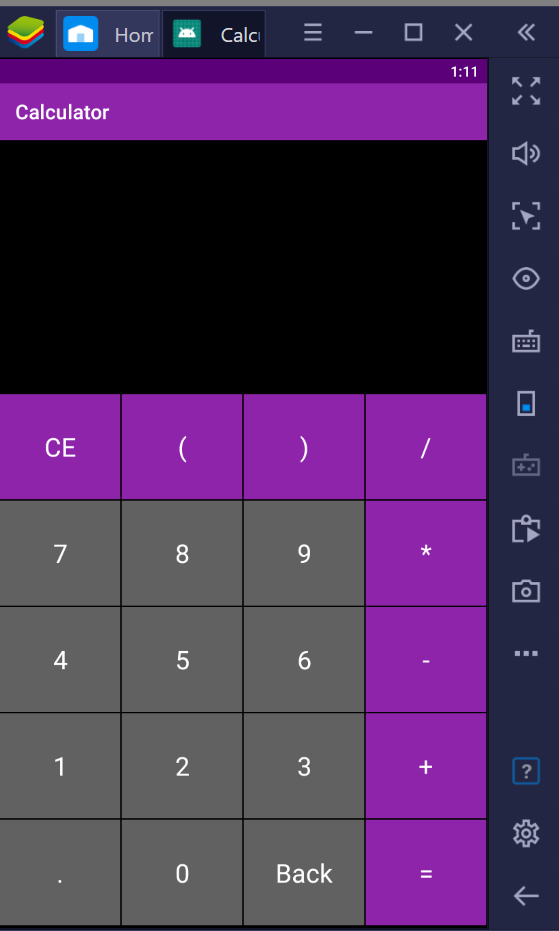
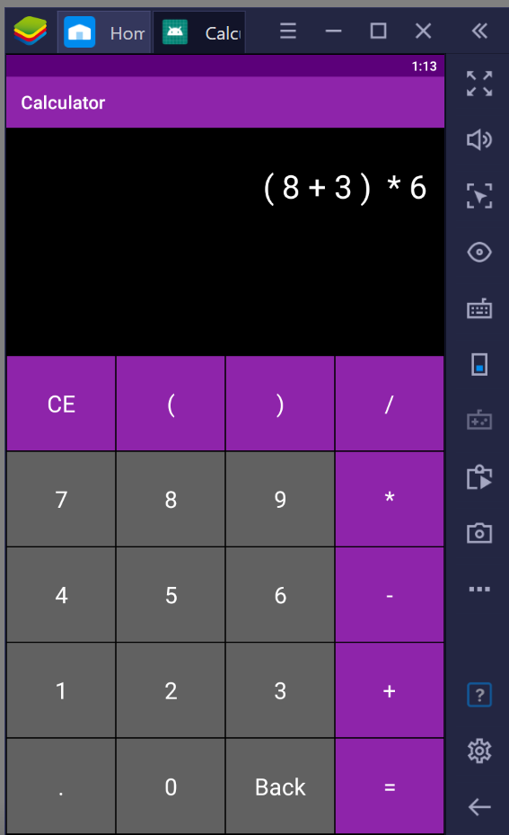
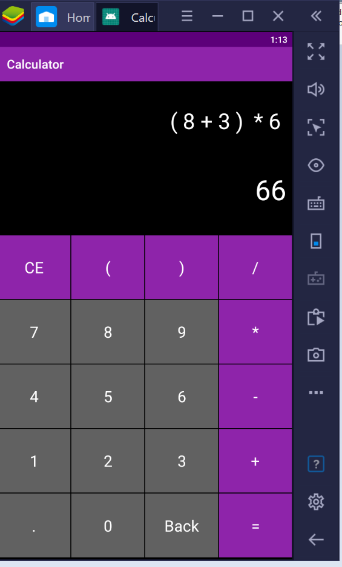

# Calculator-App
> This is my first Android project which is developed for the [**#30DaysOfKotlin**](https://twitter.com/hashtag/30daysofkotlin?lang=en) with Google Developers  
A Simple Calculator  Android application developed using Kotlin. The project is a part 30 Days of Kotlin with Google Developers

## App Preview
<table style="width:100%">
  <tr>
    <th>Home</th>
    <th>Enter Query</th>
    <th>Get Result</th>
  </tr>
  <tr>
    <td></td>
    <td></td>
    <td>
  </tr>
</table>

